Plots generated
===============

This code generates Figures 4 to 15 from the paper cited in [README.md](README.md), shown with their respective captions below.

#### Figure 4

Gap closed for independent set instances of density 80% and 300 vertices (left) and density 50% and 120 vertices (right).

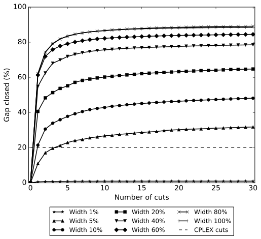 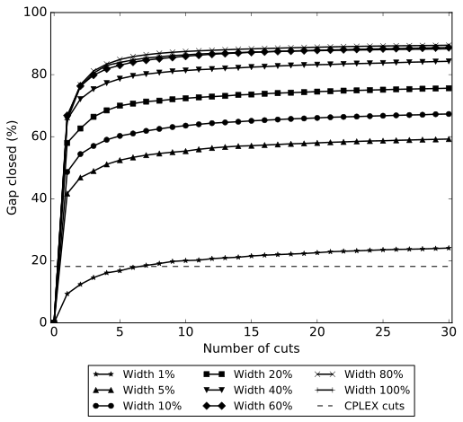

*Output files: `random_300_80_gapclosed.pdf`, `random_120_50_gapclosed.pdf`*

#### Figure 5

Face dimensions for independent set instances of density 80% and 300 vertices (left) and density 50% and 120 vertices (right).

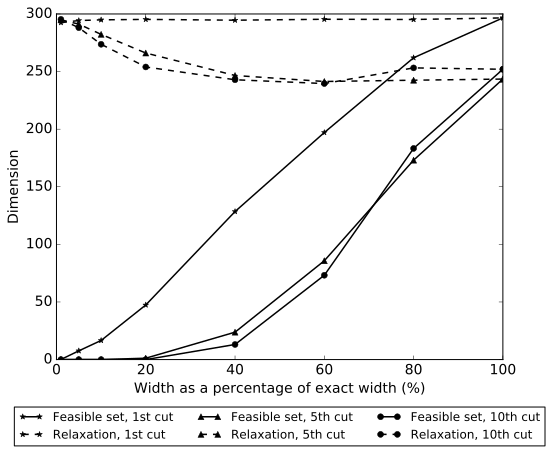 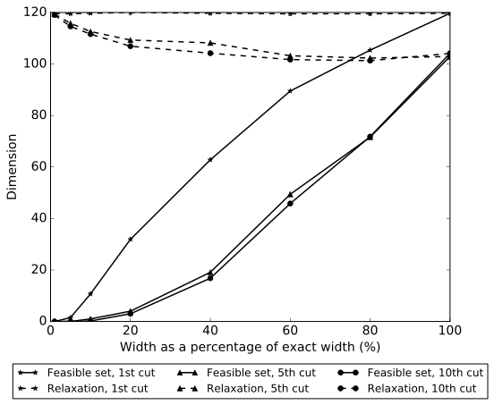

*Output files: `random_300_80_dim_width.pdf`, `random_120_50_dim_width.pdf`*

#### Figure 6

Gap closed (left) and face dimensions (right) for set covering instances of bandwidth 40.

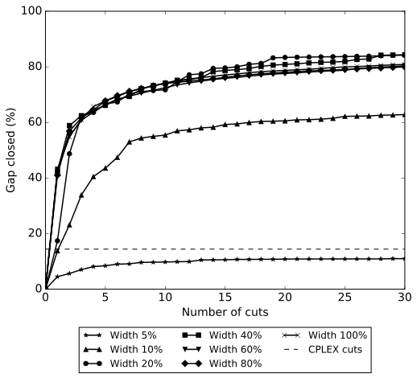 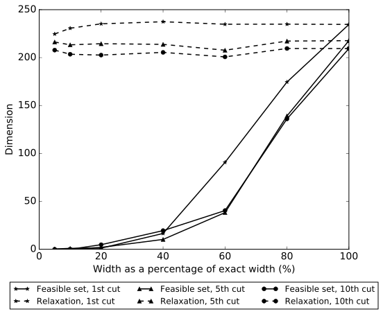

*Output files: `sc_n250_ss30_bw40_gapclosed.pdf`, `sc_n250_ss30_bw40_dim_width.pdf`*

#### Figure 7

Solving time (left) and number of nodes of branch-and-bound tree (right) for cuts on independent set instances of density 80% with 400 vertices.

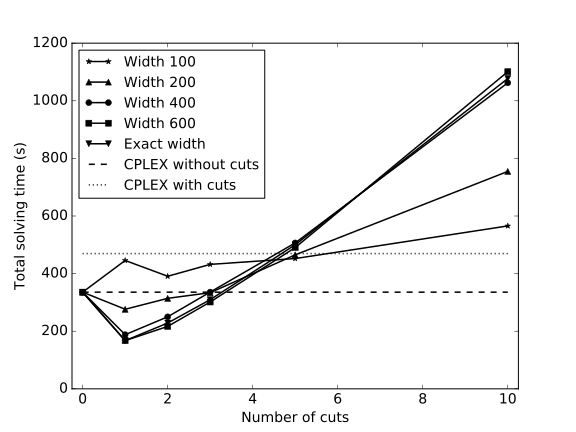 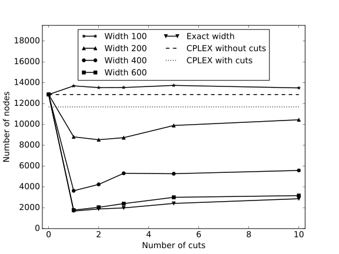

*Output files: `random_400_80_totaltime.pdf`, `random_400_80_nodes.pdf`*

#### Figure 8

Solving time (left) and number of nodes of branch-and-bound tree (right) for cuts on set covering instances of bandwidth 50.

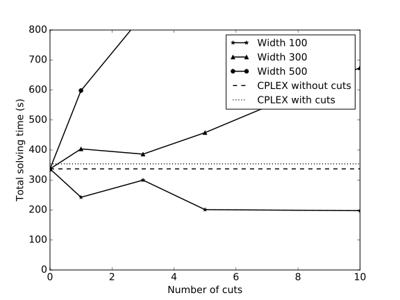 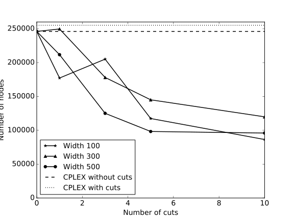

*Output files: `sc_n250_ss30_bw50_totaltime.pdf`, `sc_n250_ss30_bw50_nodes.pdf`*

#### Figure 9

Solving time (left) and number of nodes of branch-and-bound tree (right) for cuts on set covering instances of bandwidth 60.

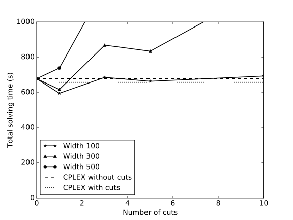 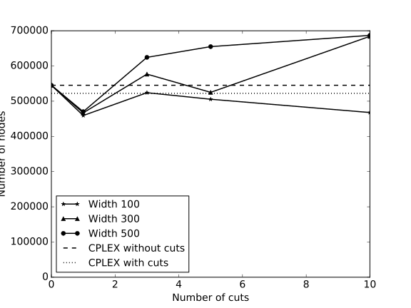

*Output files: `sc_n250_ss30_bw60_totaltime.pdf`, `sc_n250_ss30_bw60_nodes.pdf`*

#### Figure 10

Comparison between target cuts and Lagrangian cuts from relaxed decision diagrams on independent set instances of density 80% and 400 vertices.

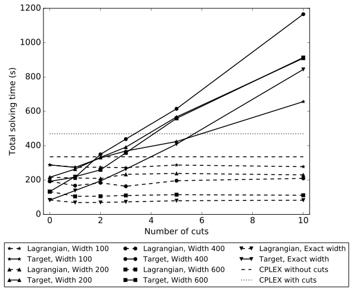 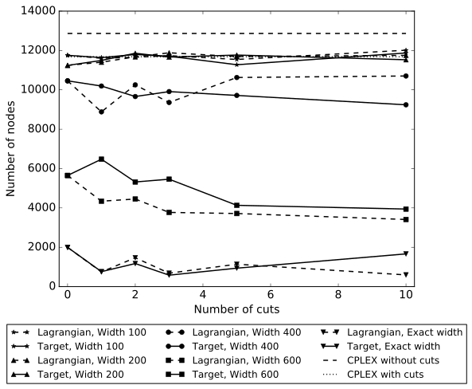

*Output files: `random_400_80_totaltime_lr.pdf`, `random_400_80_nodes_lr.pdf`*

#### Figure 11

Comparison between target cuts and Lagrangian cuts from relaxed decision diagrams on set covering instances of bandwidth 50.

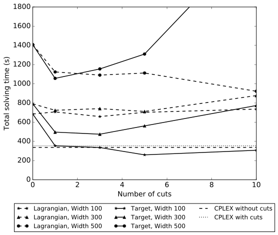 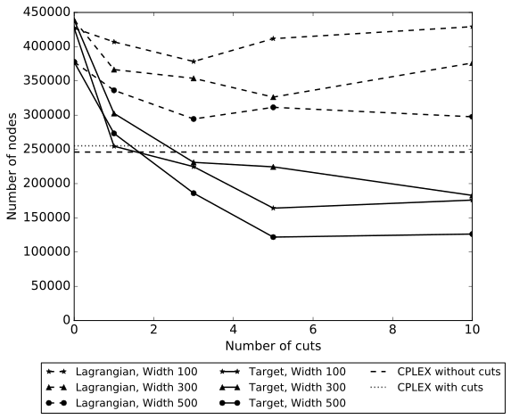

*Output files: `sc_n250_ss30_bw50_totaltime_lr.pdf`, `sc_n250_ss30_bw50_nodes_lr.pdf`*

#### Figure 12 (Appendix)

Solving time (left) and number of nodes of branch-and-bound tree (right) for cuts on independent set instances of density 50% with 250 vertices.

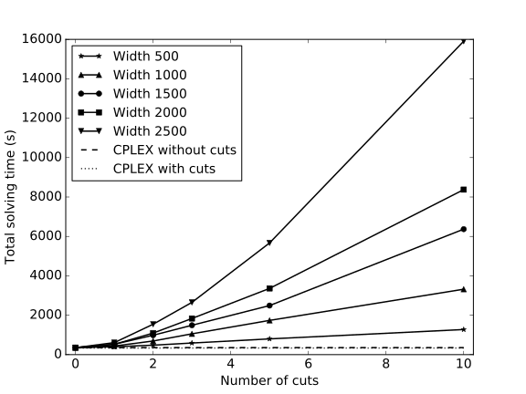 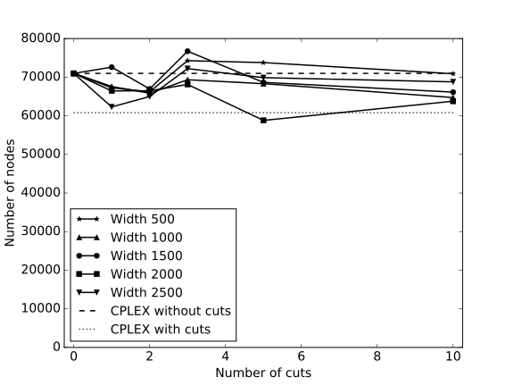

*Output files: `random_250_50_totaltime.pdf`, `random_250_50_nodes.pdf`*

#### Figure 13 (Appendix)

Solving time (left) and number of nodes of branch-and-bound tree (right) for cuts on set covering instances of bandwidth 40.

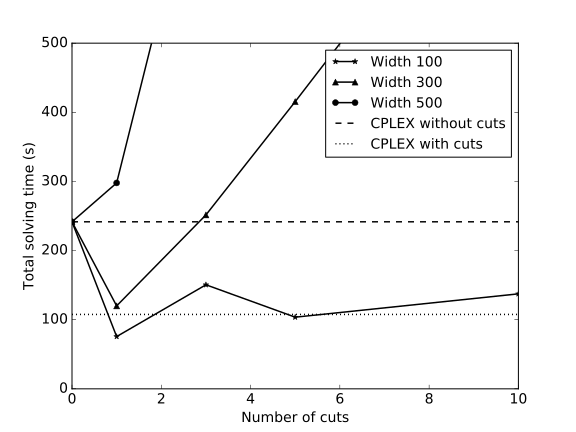 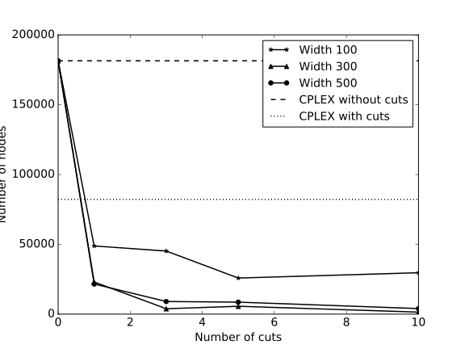

*Output files: `sc_n250_ss30_bw40_totaltime.pdf`, `sc_n250_ss30_bw40_nodes.pdf`*

#### Figure 14 (Appendix)

Total solving time breakdown with a single cut for independent set instances of density 80% with 400 vertices (left) and 50% with 250 vertices (right).

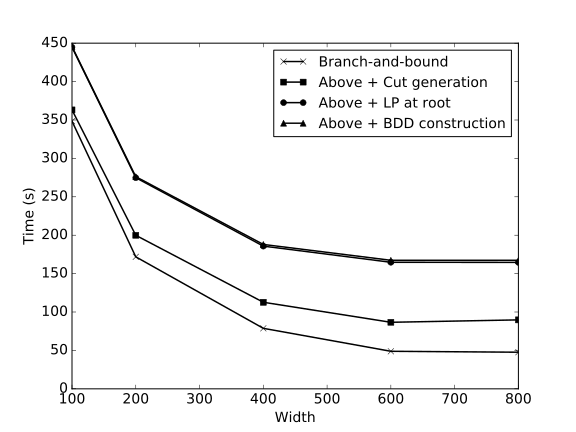 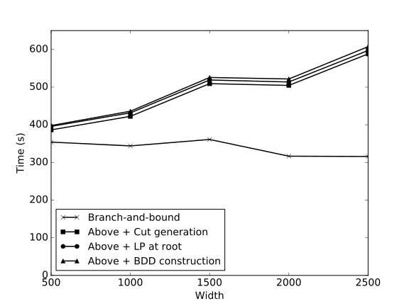

*Output files: `random_400_80_timebreakdown_1.pdf`, `random_250_50_timebreakdown_1.pdf`*

#### Figure 15 (Appendix)

Face dimensions for independent set instances of density 80% and 300 vertices (left) and density 50% and 120 vertices (right), after applying the perturbation heuristic to increase dimension.

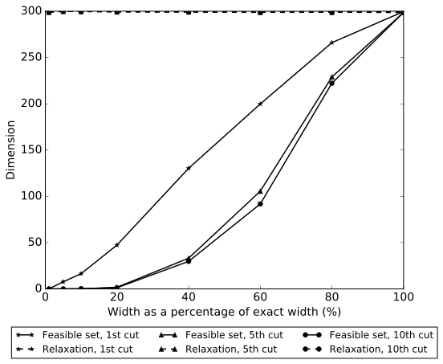 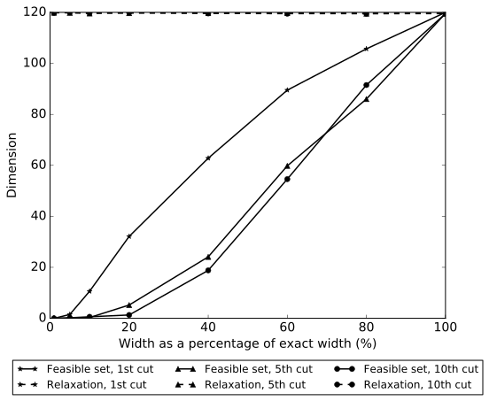

*Output files: `random_300_80_dim_pert_width.pdf`, `random_120_50_dim_pert_width.pdf`*
